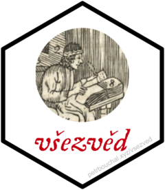

<!-- README.md is generated from README.Rmd. Please edit that file -->

# vsezved <a href='http://petrbouchal.xyz/vsezved'></a>

<!-- badges: start -->

[](https://www.tidyverse.org/lifecycle/#experimental)
[](https://github.com/petrbouchal/vsezved/actions)
[](https://github.com/petrbouchal/vsezved/actions)
<!-- badges: end -->

The goal of vsezved is to provide easy access to the Czech school
registry and contact database provided by the state at
<https://data.msmt.cz/> and <https://uiv.cz/>, respectively.

It will also provide vignettes documenting the data.

Full documentation is at
[petrbouchal.xyz/vsezved](https://petrbouchal.xyz/vsezved).

**The best overview of the data and usage are currently (in Czech) in
the blogpost at
[petrbouchal.xyz/cz/post/vsezved](https://petrbouchal.xyz/cz/post/vsezved)**

## Installation

It is not currently on CRAN.

You can install the current version of vsezved from
[Github](https://github.com) with:

``` r
remotes::install_github("petrbouchal/vsezved")
```

## Data contents

TO DO

## Basic example

This is a basic example which shows you how to solve a common problem:

``` r
library(vsezved)
## basic example code
```

## Usage

## Alternative workflow

The package supports two approaches … TO DO

## Where the data is

-   

## Credits

### Data sources

Not affiliated with the Czech Ministry of Education or the Education
Information Institute who publish the data (the latter no longer
exists). Their people however deserve credit for getting the data out
there.

### Name and logo

Všezvěd is a pilgrim’s guide in a book by the well known Czech
educationalist Comenius called *Labyrinth of the World and Paradise of
the Heart*. The image in the logo comes from [his other book, Orbis
Pictus](http://kramerius5.nkp.cz/view/uuid:426f6010-9a3f-11e4-a808-005056827e52?page=uuid:a7c9fad0-a703-11e4-b69d-5ef3fc9ae867)
(complete online version), and depicts a school…
